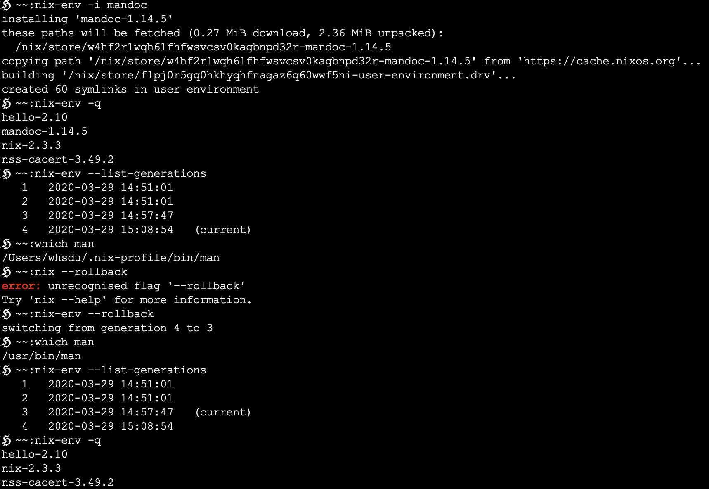

### Readings
1. [a phd-thesis about nix](https://edolstra.github.io/pubs/phd-thesis.pdf)
1. 

>This is a note for using Nix on mac book 

## Notes
1. **catalina** is a mistake 
    - 

1. [Ubuntu Nix mapping](https://nixos.wiki/wiki/Cheatsheet)


## Summay 

1. ### `nix-env` 
    - `nix-env -i mandoc` : install man .
    - `nix-env -q` : query all installed package.
        - `nix-env -q --installed` : all installed package in current generation.
    - `nix-env --list-generations` : check generations.
    - `nix-env --roll-back` : roll back to previous generation. 
    
    
    use `nix-env -i` to install `mandoc`, check with `nix-env -q` we can see that `mandoc` is installed and now we are in generation $4$ (`nix-env --list-generations)`. `which man` show where exactly the `man` is. After `nix-env --roll-back` everything is different.
    - 
1. ### `nix-store`
    - ```nix-store -q --references `which hello` ```
        direct runtime dependencies of `hello`

    - ```nix-store -q --referrers `which hello` ```
        environments that depend on `hello`.

1. ### `nix-channel`
    > A tool for managing nix-channel (package source).
    - `nix-channel --list`
    - `nix-channel --update`

1. ### language notes
    - interpolate String 
        ```
        nix-repl> foo = "strval"
        nix-repl> "$foo"
        "$foo"
        nix-repl> "${foo}"
        "strval"
        ```

    - attribute set
        ```
        nix-repl> s = { foo = "bar"; a-b = "baz"; "123" = "num"; }
        nix-repl> s
        { "123" = "num"; a-b = "baz"; foo = "bar"; }
        nix-repl> s.a-b
        "baz"
        nix-repl> s."123"
        "num"
        ```
        >Keys are either identifier or String.
        >`a-b` valid identifier; "123" (string) can also be the key.
    
        **Recursive** attribute set (**Commonly used**)
        ```
        nix-repl> rec { a = 3; b = a+4; }
        { a = 3; b = 7; }
        ```
    - `with` 
        ```
        nix-repl> longName = { a = 3; b = 4; }
        nix-repl> longName.a + longName.b
        7
        nix-repl> with longName; a + b
        7
        nix-repl> let a = 10; in with longName; a + b
        14
        nix-repl> let a = 10; in with longName; longName.a + b
        7
        ```
    - `import`
        test.nix:
        ```
        { a, b ? 3, trueMsg ? "yes", falseMsg ? "no" }:
        if a > b
          then builtins.trace trueMsg true
          else builtins.trace falseMsg false
        ```
        ```
        nix-repl> import ./test.nix { a = 5; trueMsg = "ok"; }
        trace: ok
        true
        ```
        >- In test.nix we return a function. It accepts a set, with default attributes b, trueMsg and falseMsg.
        >- builtins.trace is a built-in function that takes two arguments. The first is the message to display, the second is the value to return. It's usually used for debugging purposes.
        >- Then we import test.nix, and call the function with that set.

    || Nix | Hashkell |
    |:--:|:--:|:--:|
    |immutable value| Y| Y|
    | List | hetero: [ 1 "abc" true 2+3] | homo: ["a", "b", "c"]|
    | if | if ... then ... else| if ... then ... else|
    |let | let ... ; in ... | let ... in |
    |function| x:y: x+y| \x -> \y -> x+y|
    |Curry| Yes| Yes|
    |Pattern match| attributeSet para: mul = {a,b}:a*b| Haskell Type|

1. ### Utility functions
    - 