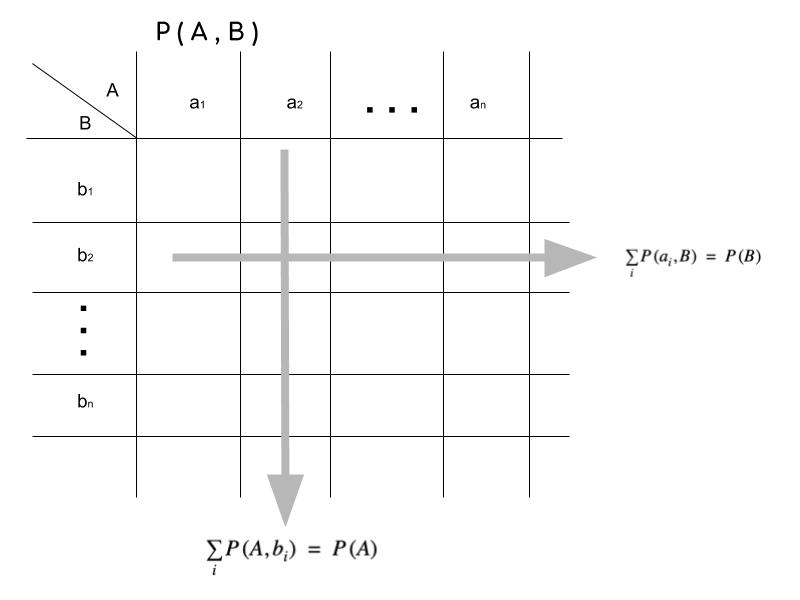
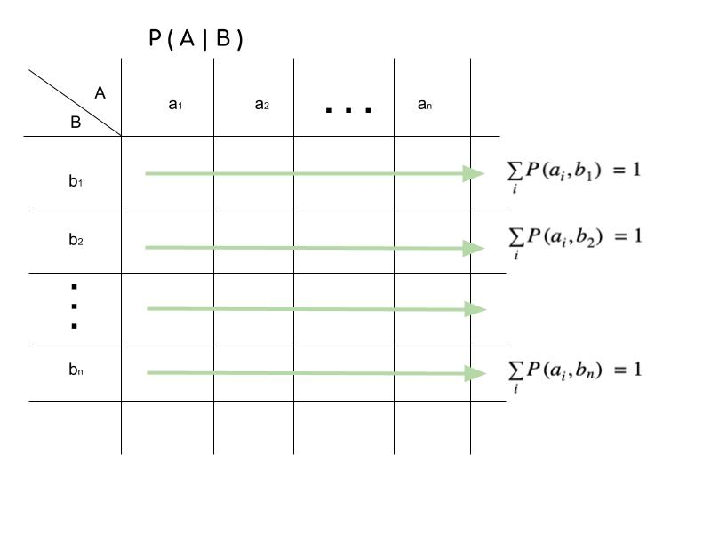
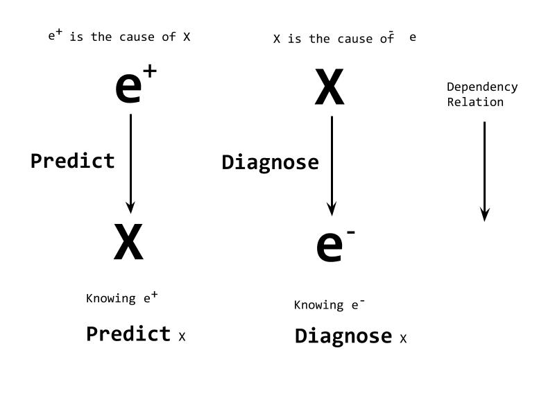
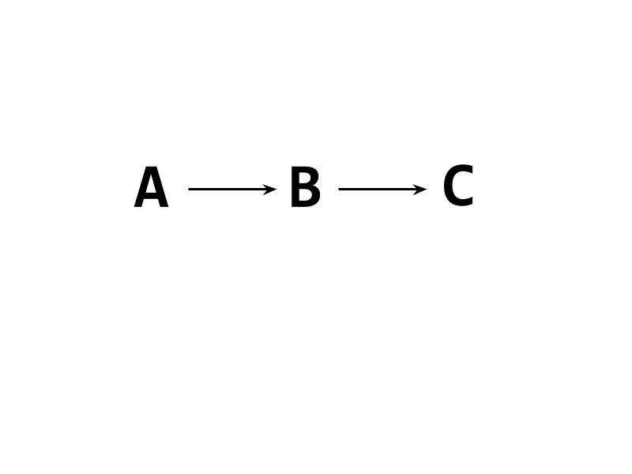
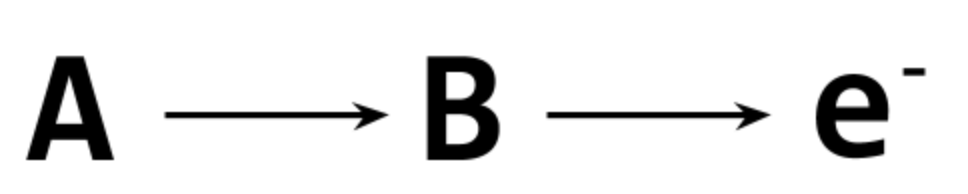
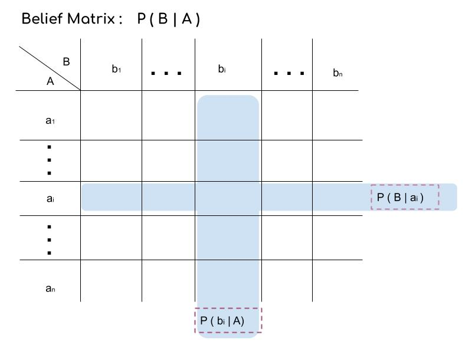
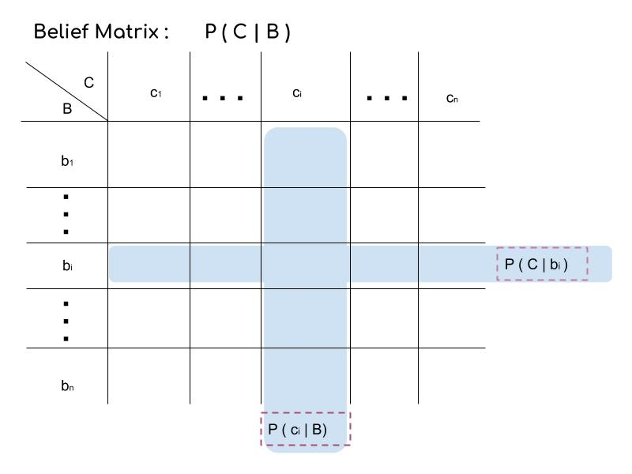

## Readings
- Probabilistic Reasoning in Intelligent Systems 
- Causality (second edition) 

## Intuitive Recap
1. `Type A`: we group `n` mutually exclusive  events together as a type. We call it `Type A`.

 <b>  A = a1 | a2 | ... | an</b>

   - Propositional Variable
   - Random Variable
   - Sum in Algebraic Data Type
   - A dimension 
   - an assertion 
   - an statement 
   - An elementary causality could lead to different outcome when facing different input.
   - an object could behave multiple choice at a given time. 
2. Interpret observations of two types `A` and `B`. 
Each value of `A` or `B` represents a distinct parallel universe. We call `A` and `B` Universe Vector `A` and `B`.

    - $P(A,B)$
        - Joint Universe Matrix. Each value of pair `(A,B)` represents a distinct parallel universe consists of Universe Vector `A` and `B`
        - The chance of these Universes sum up to 1: $\sum\limits_i\sum\limits_j P(a_i,b_j)=1$
        - Aggregate along $b_j$ over the Universe Matrix, we get the universe vector `A`: $\sum\limits_j P(a_i,b_j)=P(A)$. It is the same to get universe vector `B` $\sum\limits_i P(a_i,b_j)=P(B)$
        

    - $P(A|B)$ **Belief Matrix**
        - Conditional Universe Matrix. Two rows of Universe Matrix where `B` take different values. The distributions of `A` could be different: $P(A|b_1) \neq P(A|b_2)$
        - Normalize Joint Universe Matrix $P(A,B)$ with Universe Vector $P(B)$ (By row), we get the Conditional Universe Matrix (**Belief Matrix**): $P(A|B)=\frac{P(A,B)}{P(B)}$
        >$\sum\limits_iP(a_i|b_j)=1$ 
        
        

    - Independent Variable
        - If the Universe Vector `A` cannot be affected by any value of Universe Vector `B`. In other words, $P(A|b_1) = P(A|b_2) = ...=P(A|b_n)$. Universe Vector `A` and `B` are independent event/type/variable. 
        - $P(A) \oplus P(B) = P(A,B)$
        - $\oplus$ is the [vector out product notation](https://en.wikipedia.org/wiki/Outer_product).
    - $P(A|B) = \frac{P(A,B)}{P(B)}$
        - $P(A,B)$ contains the most desirable information. we get $P(A)$, $P(B)$, $P(A|B)$, $P(B|A)$ all other type of information from it. 
        - In reality, we can observe $P(B)$ and $P(A|B)$ more often.
        - This is more obvious when trying to include more type/event/variable $P(A,B,C,D,E...)$. We tend to observe partial universe like $P(A,B)$ and $P(A,C|E)$ but not the entire possibility, the number of all possibilities increase dramatically as the number of type/event/variable increase. Human have no concept of increase of dimensions, as the dimension increase we quickly loss track of the scale of the problem.

3. Conditional Independent & Naive Bayesian 
  - Naive Bayesian: 
    `H` is a Universe Vector contains two hypotheses `h happening` ($h$) and `h not happening` ($\neg h$).
        - $P(h|e) = \frac{P(e|h)P(h)}{P(e)}$
        - To get the `posterior knowledge` $P(h|e)$, we update our `prior knowledge` $P(h)$ with the `likelihood` $P(e|h)$ and normalized by `evidence` $P(e)$.
    - Most of the time. We don't need to compute `P(e)` explicitly
    - `prior odds`: $O(h) = \frac{P(h)}{P(\neg h)}$
    - `likelihood ratio`: $L(e|h) = \frac{P(e|h)}{P(e|\neg h)}$$$
    - `posterior odds`: $O(h|e) = \frac{P(h|e)}{P(\neg h|e)}$$$
    - we use following two equations to compute the naive bayesian 

 <b>O ( h | e ) = O ( h )  L ( e | h ) </b>

 <b>P ( h | e ) = O ( h | e ) / (  1 + O ( h | e )  )  </b>
   

   - It is possible that :
       - We observed two events $ e^+ $ and $e^-$
       - We care about our Belief of the Universe Vector $X$.

 <b>BEL(X) = P( X |e+,e- )</b>
   

   > Equation 1:  $BEL(X) = \frac{P(e^-|X,e^+)P(X|e^+)}{P(e^-|e^+)}$
   > Equation 2:  $BEL(X) \propto P(e^-|X,e^+) \times P(X|e^+)$
   > Equation 3:  $BEL(X) \propto P(e^-|X) \times P(X|e^+)$
   
  - . `Equation 1` is an extension of `Naive Bayesian`. 
    - event `e` or Universe Vector `A` on the right hand side of $|$ represents the context of the left hand side, eg:
    $P(A|B,e)$: `B` and `e` are context of Universe vector `A`
    - **Context Information**: We could remove or add a common context to the Universe Vector or Matrix  and the equation still be valid, eg:
        $ P(X|e^-)= \frac{P(e^-|X)P(X)}{P(e^-)}$ 
        add common context $e^+$
        $P (X|e^-,e^+) = \frac{P(e^-|X,e^+)P(X|e^+)}{P(e^-|e^+)}$
  - . `Equation 1` to `Equation 2`
       - Generally we don't need to compute $P(e^-|e^+)$, it is just an `normalization factor` to make sure values of Universe Vector $P(X|^-,e^+)$ added up to 1. We can use `Equation 2` to compute `BEL(X)` then do the normalization.
  - . **Conditional Independent** : From `Equation 2` to `Equation 3`
       - **iff** knowing the value of Universe Vector $X$ makes the information of $e^+$ conditionally independent from $e^+$. 
       - In other words, if we know which parallel universe we observed from Universe Vector $X$, $e^+$ can provide us no more information about $e^-$.
       - The relation is :
        
       - In this relation shape:
            - $e^-$ is diagnose support 
            - $e^+$ is the casual support 
    
            - we denote: $\lambda= P(e^-|X)$ and $\pi=P(X|e^+)$
            - $BEL(X) = \lambda \times \pi$
            - $BEL(X)$, $\lambda$ and $\pi$ are Universe Vectors 
            - $\times$ is elementary product. 
            - $\lambda(X)$ is likelihood Vector of $X$
            - $\pi(X)$ is prior Vector of $X$

 <b>BEL(X) = &alpha; &pi;(X) &lambda;(X) </b>
   

4. Belief Propagation
    
    About this relationship above we know 2 piece of information:
    - . $C$ is `Conditional Independent` from $A$ given $B$
        $P(C|B) = P(C|B,A)$
    - . Two **Belief Matrix**:
        - `B` maintains $P(B|A)$ 
        - `C` maintains $P(C|B)$ 
        **Belief Matrix** is the most common and easy access of information.
    - The are two kinds of elementary situations:

4.1 when we observed that $C$ is $e^-$.
   
   - Known: $\lambda(B) = P(e^-|B)$
   - Known: Belief Matrix $P(A|B)$
   
   - Want: $\lambda(A) = P(e^-|B)$
   The information in the diagnose support $\lambda(B)$ be passed to the diagnose support $\lambda(A)$ through **Belief Matrix** $P(A|B)$
        - $\lambda(A) = P(e^-|A) = \sum\limits_BP(e^-|B) P(B|A)$
        - $\lambda(A) = P(B|A) \cdot \lambda(B)$
   - The chance of Parallel universes of $\lambda(A)$ do not need to be sum up to 1.

4.2 when $A$ is $e^+$
   - Known: $\pi(B) = P(B|e^+)$
   - Known: Belief Matrix $P(C|B)$
   
   - Want: $\pi(C) = P(C|e^+)$
   The information in the predict support of $\pi(B)$ pass to the predict support  $P(C|B)$ through **Belief Matrix** $P(C|B)$
        - $\pi(C) = P(C|e^+) = \sum\limits_B P(B|e^+)P(C|B)$
        - $\pi(C) = \pi(B)^T \cdot P(C|B)$
   - The chance of Parallel universes of $\pi (C)$ do not need to be sum up to 1
    
>References: Probabilistic Reasoning in Intelligent Systems: Chapter 4 P154

## .Detail Recap 

1. Upper case letters always mean a distinct dimension (Rank-1 tensor)
1. The number of Upper case letters is the number of Ranks of the entire expression.
1. Upper case letters indicate uncertainty.
1. Upper case letters response for the propagation of the information(uncertainty).
1. Matrix: TWO Upper case letters 
    - $P(A,B)$ 
    - $P(A|B)$
1. Vector: One upper case letters 
    - $P(A)$ or $P(B)$
    - $\lambda$: $P(A|b_i)$ 
    - $\pi$: $P(a_i|B)$ 

## TODO 
. initialization of $e^+$ and $e^-$
. belief propagation rules of different branch types
. training 

